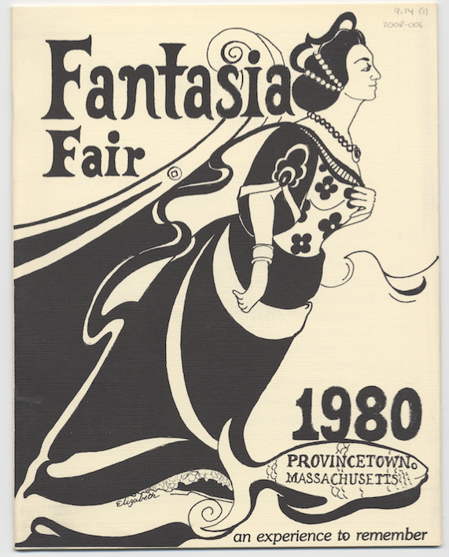

# Preparing your Design

## Picking a Design

1. Find an image that you would like to try vectorizing for your print and save it to your computer. The best images meet these requirements:

   -Have high contrast between the colours, meaning a good distinction between them.
   
   -Have minimal colour variation, try to pick a design with only two colours for the first one.
   
   -Is black and white or can easily be made black and white.
   
   -Not too detailed, flat designs work best for beginners.

These are images that are good examples of designs that would work. Not only are they black and white, they are clear, simple, flat designs with only two "values". You will see that there is some editing to be done, such as cropping, erasing pencil marks, and some colour adjustments for extra clarity. In the next step we will go over how to process your photo so it is perfect for vectorizing.

## Editing your Design in Photopea

If your design needs extra processing before you can vectorize, such as cropping, blending out small flaws in the design, increasing contrast or making black and white then follow these steps.

1. Open up **Photopea** in your browser.

2. Select *"Open from Computer"* and navigate to your saved image. Select and open it.

3. Crop your image if needed by selecting the *“Crop Tool”* pictured. Drag the corners of the image to crop out parts you don’t want such as backgrounds, excess space, or marks.

4. Turn your image to black and white for better vectorizing. Select the adjustment layers at the bottom of the layers window on the bottom right of the Photopea workspace. Select *“Black and White”*

5. Increase the contrast by selecting another adjustment layer called *“Brightness/Contrast”*. To the left, a window with two spectrums for the brightness and contrast should have appeared. Adjust accordingly so that you have a bright, high contrast black and white image. 

6. If you need to remove any marks that you don’t want in the final design, select the *“Eyedropper”* tool and select the colour of what you want to clean the marks up with. In this example I chose the white background so I could cover up the pencil marks. Select the *“Brush Tool”* and paint over the marks.

7. Export your file by going to *“File”* in the top left corner. Select *“Export As”* and choose a location to save the file to. 

[NEXT STEP: Vectorizing your Design in Inkscape](vectorizing-design.html){: .btn .btn-blue }
