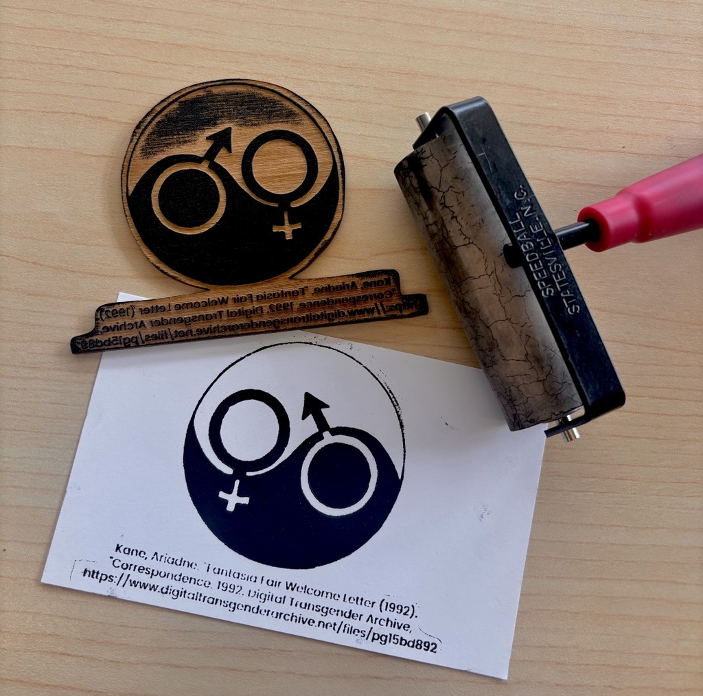

# Design for Digital Woodblock Printing using Laser Cutting

- Pre-workshop activities: 00 min 
- Introductory presentation: 00 min
- Hands-on activities: 00-00 min

## What are wood block prints?

Wood block prints are a traditional Chinese method for printing text. They are used by applying ink to a carved "stamp" and then pressing it to paper to transfer to ink to it, originally used for producing texts or early books. Traditionally done by carving out of blocks of wood, the method has been adapted to other modern practices including linocut block prints and in this case, lasercutting designs onto wood.

## What is laser cutting? 

**Laser cutting** is a process for cutting materials to create 2D and 3D designs.  From a digital file, laser cutters use computer controlled high powered lasers to engrave or cut wood, metal, paper and more with high precision.

Laser cutting is a fast and accurate way to engrave objects, make boxes, design stencils, and more!

## What tools do we use?

[Inkscape](https://inkscape.org/){:target="_blank"} is a free and open source design tool for making and editing vector graphics.  Inkscape uses the standardized SVG file format as its main format, which is supported by many other applications including web browsers.

Another design tool is [Photopea](https://www.photopea.com/){:target="_blank"}, a free online image editor.  You can export designs in several formats including .SVG. 

This workshop is not an endorsement of Inkscape or Photopea; there are many options for 2D design and other software may be better for different contexts or preferences.

## Learning objectives

At the end of this workshop, you will be able to:

1. Explain to others the origin and use for woodblock printing
2. Explain to others what relief printing means
3. Tell the difference between negative and positive printing 
4. Sourcing appropriate designs through books or online
5. Edit your image using Photopea
6. Vectorize and invert your image using Inkscape
7. Exporting your images with proper file types (such as .png or .svg)
8. Describe the difference between vector and raster cuts for engraving
9. Explain how the lasercutter works 

 
[NEXT STEP: Pre-Workshop Activities](pre-workshop.html){: .btn .btn-blue }
